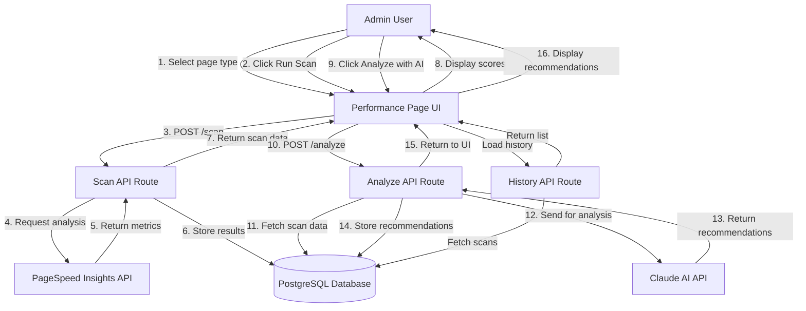
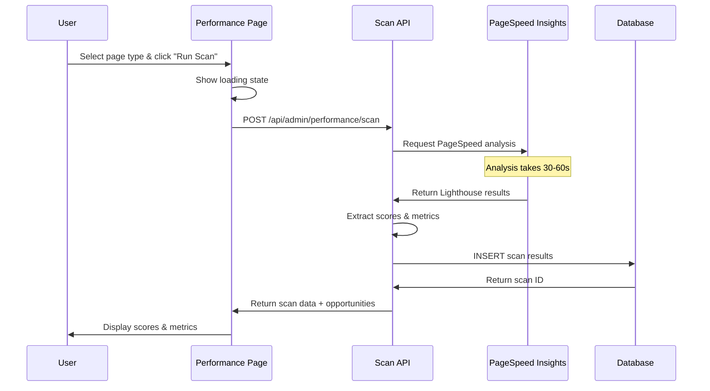
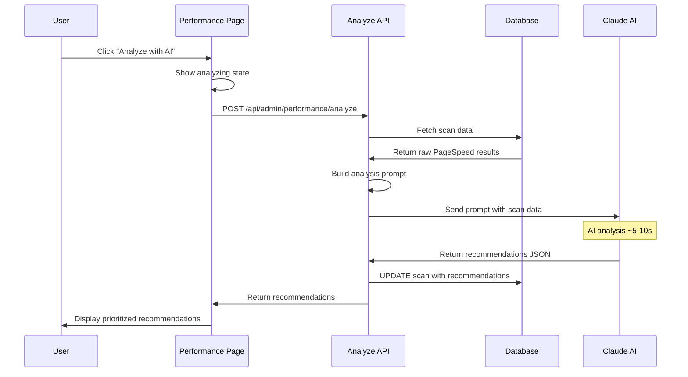
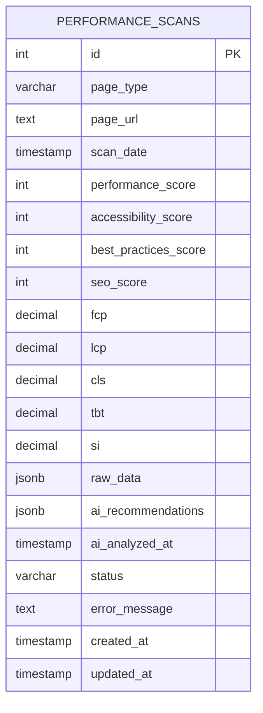
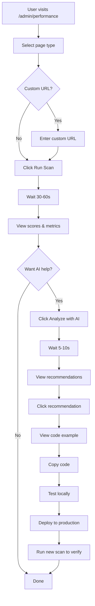

# Performance Page - Architecture & Workflow

## System Architecture



## Data Flow

### 1. Scan Workflow



### 2. AI Analysis Workflow



## Database Schema



## Component Structure

```
app/
├── admin/
│   └── performance/
│       └── page.tsx                    # Main UI component
│
├── api/
│   └── admin/
│       └── performance/
│           ├── scan/
│           │   └── route.ts            # PageSpeed integration
│           ├── analyze/
│           │   └── route.ts            # AI analysis
│           ├── history/
│           │   └── route.ts            # Fetch scans
│           └── [id]/
│               └── route.ts            # Get/delete scan
│
components/
├── admin/
│   ├── AdminLayout.tsx                 # Updated with nav item
│   ├── Sidebar.tsx                     # Updated with icon
│   ├── StatCard.tsx                    # Used for scores
│   └── DataTable.tsx                   # Used for tables
│
lib/
└── db/
    └── schema/
        └── performance-scans.sql       # Database schema
```

## API Endpoints

### POST /api/admin/performance/scan

**Request:**
```json
{
  "pageType": "homepage" | "collection" | "product" | "custom",
  "customUrl": "https://..." // optional, for custom type
}
```

**Response:**
```json
{
  "success": true,
  "scan": {
    "id": 1,
    "page_type": "homepage",
    "page_url": "https://www.theequestrian.com.au",
    "scan_date": "2026-02-06T12:00:00Z",
    "performance_score": 85,
    "accessibility_score": 92,
    "best_practices_score": 88,
    "seo_score": 95,
    "fcp": 1.2,
    "lcp": 2.1,
    "cls": 0.05,
    "tbt": 150,
    "si": 1.8
  },
  "opportunities": [...],
  "diagnostics": [...]
}
```

### POST /api/admin/performance/analyze

**Request:**
```json
{
  "scanId": 1
}
```

**Response:**
```json
{
  "success": true,
  "recommendations": {
    "summary": "The main performance issues are...",
    "priority_issues": [
      {
        "title": "Large images slowing LCP",
        "severity": "high",
        "impact": "Reduce LCP by 0.8s",
        "metric": "LCP"
      }
    ],
    "recommendations": [
      {
        "title": "Optimize images with Next.js Image",
        "priority": "high",
        "category": "images",
        "description": "Use Next.js Image component...",
        "code_example": "import Image from 'next/image'...",
        "file_location": "components/ProductCard.tsx",
        "expected_impact": "Reduce LCP by 0.5s",
        "implementation_notes": "Test on staging first"
      }
    ]
  }
}
```

### GET /api/admin/performance/history

**Query Parameters:**
- `pageType` (optional): Filter by page type
- `limit` (optional): Number of results (default: 20)

**Response:**
```json
{
  "success": true,
  "scans": [
    {
      "id": 1,
      "page_type": "homepage",
      "page_url": "https://...",
      "scan_date": "2026-02-06T12:00:00Z",
      "performance_score": 85,
      "accessibility_score": 92,
      "best_practices_score": 88,
      "seo_score": 95,
      "status": "completed",
      "ai_analyzed_at": "2026-02-06T12:05:00Z"
    }
  ]
}
```

### GET /api/admin/performance/[id]

**Response:**
```json
{
  "success": true,
  "scan": {
    "id": 1,
    "page_type": "homepage",
    "page_url": "https://...",
    "scan_date": "2026-02-06T12:00:00Z",
    "performance_score": 85,
    "raw_data": {...},
    "ai_recommendations": {...}
  }
}
```

### DELETE /api/admin/performance/[id]

**Response:**
```json
{
  "success": true,
  "message": "Scan deleted"
}
```

## User Journey



## Safety Architecture

The system is designed with multiple safety layers:

```mermaid
flowchart LR
    AI[AI Generates Code]
    Display[Display to User]
    Review[Human Review]
    Copy[Copy Code]
    Local[Test Locally]
    Git[Commit to Git]
    Staging[Deploy to Staging]
    Test[Test Thoroughly]
    Prod[Deploy to Production]
    Monitor[Monitor Results]
    
    AI --> Display
    Display --> Review
    Review -->|Approved| Copy
    Review -->|Rejected| Display
    Copy --> Local
    Local --> Git
    Git --> Staging
    Staging --> Test
    Test -->|Pass| Prod
    Test -->|Fail| Local
    Prod --> Monitor
    
    style AI fill:#e1f5ff
    style Review fill:#fff3cd
    style Test fill:#fff3cd
    style Prod fill:#d4edda
```



## Technology Stack

### Frontend
- **Framework:** Next.js 16 (App Router)
- **UI Library:** React 19
- **Styling:** Tailwind CSS 4
- **State Management:** React useState/useEffect
- **Type Safety:** TypeScript 5

### Backend
- **API Routes:** Next.js API Routes
- **Database:** Neon PostgreSQL
- **Database Client:** @vercel/postgres
- **Environment:** Node.js

### External APIs
- **PageSpeed Insights:** Google PageSpeed Insights API v5
- **AI Analysis:** Anthropic Claude API (claude-3-5-sonnet)

### Infrastructure
- **Hosting:** Vercel
- **Database:** Neon (PostgreSQL)
- **CDN:** Vercel Edge Network

## Performance Considerations

### API Response Times
- **Scan API:** 30-60 seconds (PageSpeed limitation)
- **Analyze API:** 5-10 seconds (Claude processing)
- **History API:** < 100ms (database query)
- **Get Scan API:** < 100ms (database query)

### Database Queries
- All queries use indexes for optimal performance
- JSONB columns for flexible data storage
- Timestamps for efficient sorting and filtering

### Caching Strategy
- Scan results stored in database
- No client-side caching (always fresh data)
- Consider adding Redis cache for frequently accessed scans (future enhancement)

## Security Considerations

### Authentication
- Uses existing admin authentication system
- All routes protected by admin middleware

### API Keys
- Stored in environment variables
- Never exposed to client
- Rotated regularly (recommended)

### Data Privacy
- Scan data stored securely in database
- No PII collected
- URLs scanned are public-facing pages only

### Input Validation
- Page type validated against allowed values
- Custom URLs validated for format
- Scan IDs validated as integers

## Monitoring & Observability

### Metrics to Track
- Scan success rate
- Average scan duration
- AI analysis success rate
- Database query performance
- API error rates

### Logging
- All API errors logged to console
- Failed scans stored with error messages
- Successful operations logged for audit

### Alerts (Future Enhancement)
- Alert on repeated scan failures
- Alert on API quota approaching limit
- Alert on database connection issues

## Scalability

### Current Limits
- PageSpeed API: 25K requests/day (with key)
- Claude API: Based on plan
- Database: Neon free tier (10GB)

### Scaling Considerations
- Add Redis cache for scan results
- Implement request queuing for high volume
- Add rate limiting per user
- Consider batch scanning for multiple pages

## Future Enhancements

### Phase 2 (Potential)
- Scheduled scans (cron jobs)
- Performance budgets
- Trend analysis
- Comparison views
- PDF reports
- Slack/email notifications

### Phase 3 (Potential)
- CI/CD integration
- Automated testing
- A/B testing integration
- Custom metrics tracking
- Team collaboration features

---

**Architecture designed for safety, scalability, and ease of use.**
