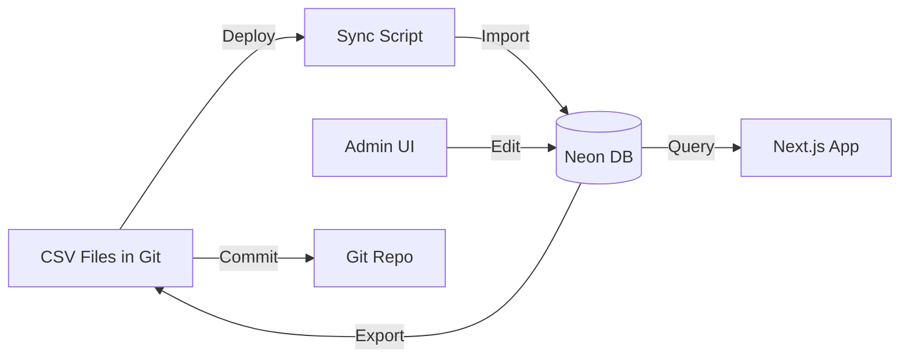

# CSV vs Database: Content Management Analysis

**Date**: January 20, 2026  
**Context**: Evaluating whether to keep CSV files or migrate to Neon PostgreSQL

---

## Current State

### CSV Files in Use (`exports/` directory)

**Content Management:**
1. `collection-content.csv` (238 rows) - Category titles, descriptions, FAQs, metadata
2. `mega-menu-content.csv` - Navigation menu structure
3. `home-sections.csv` - Homepage content sections
4. `sale-pages.csv` - Sale page configurations

**Configuration:**
5. `brand-mapping.csv` - Brand/vendor mappings
6. `mapping-template.csv` - Product type to category mappings
7. `product-types.csv` - Product type definitions
8. `tag-shipping-rates.csv` - Shipping rate configurations
9. `vendor-shipping-rates.csv` - Vendor-specific shipping

**Data Exports:**
10. `collections.csv` / `collections.json` - Collection exports
11. `sitemap-current.csv` / `sitemap-current.json` - Sitemap data

### Database Already in Use (Neon PostgreSQL)

**Current tables:**
- `products` - 9,943+ products (synced from Shopify)
- `reviews` / `review_stats` - Review data
- `facet_cache` - Filter/facet caching
- `sync_log` - Sync tracking

---

## Comparison Matrix

| Aspect | CSV Files | Neon PostgreSQL Database |
|--------|-----------|--------------------------|
| **Current Usage** | Content & config (11 files) | Products & reviews |
| **Performance** | Fast (in-memory after load) | Very fast (indexed queries) |
| **Deployment** | Git commit → instant deploy | Requires migration/sync |
| **Versioning** | ✅ Full Git history | ❌ Requires separate tracking |
| **Rollback** | ✅ Git revert | ❌ Requires backup/restore |
| **Editing** | ✅ Any text editor | ❌ Requires SQL or admin UI |
| **Non-technical edits** | ✅ Excel/Google Sheets | ❌ Needs custom UI |
| **Data validation** | ⚠️ Runtime only | ✅ Schema constraints |
| **Relationships** | ❌ Manual (no foreign keys) | ✅ Foreign keys, joins |
| **Search** | ❌ Full file scan | ✅ Indexed searches |
| **Concurrent edits** | ❌ Merge conflicts | ✅ ACID transactions |
| **Caching** | ✅ Built-in (file system) | ⚠️ Requires Redis/KV |
| **Cost** | ✅ Free (Git storage) | ⚠️ Database storage costs |
| **Scalability** | ⚠️ Limited (file size) | ✅ Millions of rows |
| **Backup** | ✅ Automatic (Git) | ⚠️ Requires setup |

---

## Detailed Analysis

### 1. Content Management Files

#### `collection-content.csv` (238 rows)

**Current approach (CSV):**
```csv
url_path,h1_title,meta_title,meta_description,short_description,long_description,breadcrumb_label,...
/horse,Horse,Horse | The Equestrian,Shop Horse products...,...
```

**Pros of keeping CSV:**
- ✅ **Git versioning** - Full history of every change
- ✅ **Easy rollback** - `git revert` to undo bad changes
- ✅ **Fast deployment** - Commit → push → instant live
- ✅ **No migration** - Works immediately in dev/staging/prod
- ✅ **Simple editing** - Any text editor, Excel, Google Sheets
- ✅ **Code review** - Changes visible in PRs
- ✅ **Fast reads** - Loaded once at build/startup, cached in memory
- ✅ **No database overhead** - No connection pooling, no queries
- ✅ **Disaster recovery** - Entire history in Git

**Cons of keeping CSV:**
- ❌ **Merge conflicts** - Multiple editors can cause conflicts
- ❌ **No relationships** - Can't enforce foreign keys
- ❌ **Limited validation** - Only at runtime
- ❌ **No concurrent edits** - One person at a time (practically)
- ❌ **Search limitations** - Must scan entire file
- ❌ **No audit trail** - Git log only, no user tracking

**Database approach:**

```sql
CREATE TABLE collection_content (
  id SERIAL PRIMARY KEY,
  url_path TEXT UNIQUE NOT NULL,
  h1_title TEXT NOT NULL,
  meta_title TEXT NOT NULL,
  meta_description TEXT,
  short_description TEXT,
  long_description TEXT,
  breadcrumb_label TEXT,
  parent_url TEXT REFERENCES collection_content(url_path),
  category_level INTEGER,
  status TEXT DEFAULT 'published',
  faq_items JSONB,
  related_categories JSONB,
  created_at TIMESTAMPTZ DEFAULT NOW(),
  updated_at TIMESTAMPTZ DEFAULT NOW(),
  updated_by TEXT
);

CREATE INDEX idx_url_path ON collection_content(url_path);
CREATE INDEX idx_parent_url ON collection_content(parent_url);
CREATE INDEX idx_status ON collection_content(status);
```

**Pros of database:**
- ✅ **Foreign keys** - Enforce parent/child relationships
- ✅ **Constraints** - Validate data at write time
- ✅ **Concurrent edits** - Multiple users can edit safely
- ✅ **Audit trail** - Track who changed what when
- ✅ **Fast searches** - Indexed queries
- ✅ **Partial updates** - Update one field without loading all
- ✅ **Transactions** - All-or-nothing updates
- ✅ **Admin UI** - Can build web interface for editing

**Cons of database:**
- ❌ **No Git history** - Loses version control benefits
- ❌ **Deployment complexity** - Must sync dev → staging → prod
- ❌ **Slower deployment** - Database migration required
- ❌ **Caching needed** - Must cache to match CSV speed
- ❌ **Rollback complexity** - Need backup/restore strategy
- ❌ **Editing friction** - Can't just open in Excel
- ❌ **Cost** - Database storage and compute

---

### 2. Configuration Files

#### `brand-mapping.csv`, `mapping-template.csv`, `product-types.csv`

**Nature**: Configuration files that rarely change

**Recommendation**: **Keep as CSV**

**Reasons:**
1. ✅ Configuration as code (Infrastructure as Code principle)
2. ✅ Changes should be reviewed (PR process)
3. ✅ Need version history
4. ✅ Should deploy with code
5. ✅ Read-only at runtime (perfect for CSV)
6. ✅ Small file sizes (< 1000 rows)

**Similar to:**
- Next.js config files
- Tailwind config
- Environment variable templates

---

### 3. Dynamic Content Files

#### `mega-menu-content.csv`, `home-sections.csv`, `sale-pages.csv`

**Nature**: Marketing content that changes frequently

**Recommendation**: **Consider database OR keep CSV with CMS**

**Hybrid approach:**
```typescript
// Option 1: Keep CSV, add preview/publish workflow
// - Edit CSV in staging
// - Preview changes
// - Merge to main when ready

// Option 2: Move to database with CMS
// - Build admin UI for editing
// - Keep Git as source of truth
// - Export to CSV for deployment
```

---

## Recommended Strategy

### Phase 1: Keep CSV (Current - Optimal for now)

**Keep these as CSV:**
- ✅ `collection-content.csv` - Content management
- ✅ `brand-mapping.csv` - Configuration
- ✅ `mapping-template.csv` - Configuration
- ✅ `product-types.csv` - Configuration
- ✅ `tag-shipping-rates.csv` - Configuration
- ✅ `vendor-shipping-rates.csv` - Configuration

**Why:**
- Small dataset (238 categories)
- Infrequent changes (weekly/monthly)
- Benefits of Git versioning outweigh database benefits
- Fast performance (cached in memory)
- Simple deployment workflow
- No migration needed

**Improvements to make:**
- ✅ Already done: Preview tool (`npm run preview-titles`)
- ✅ Already done: Validation script
- 🔄 Add: Automated validation in CI/CD
- 🔄 Add: CSV linting pre-commit hook
- 🔄 Add: Better merge conflict resolution docs

### Phase 2: Hybrid Approach (Future - If needed)

**Move to database when:**
1. Content editors need real-time updates (can't wait for deployment)
2. Multiple people editing simultaneously
3. Need complex relationships/joins
4. Dataset grows beyond 1000+ rows
5. Need user-specific permissions

**Hybrid architecture:**
```
┌─────────────────────────────────────────┐
│  Git Repository (Source of Truth)       │
│  ├── exports/collection-content.csv     │
│  └── Database sync on deploy            │
└─────────────────────────────────────────┘
                    ↓
┌─────────────────────────────────────────┐
│  Neon PostgreSQL (Runtime)              │
│  ├── collection_content table           │
│  ├── Fast queries with indexes          │
│  └── Synced from CSV on deployment      │
└─────────────────────────────────────────┘
                    ↓
┌─────────────────────────────────────────┐
│  Application (Next.js)                  │
│  ├── Reads from database                │
│  └── Falls back to CSV if DB unavailable│
└─────────────────────────────────────────┘
```

**Benefits:**
- ✅ Keep Git as source of truth
- ✅ Get database query performance
- ✅ Can build admin UI for editing
- ✅ Database changes can be exported back to CSV
- ✅ Best of both worlds

### Phase 3: Full Database (Future - If scaling)

**Move completely to database when:**
1. 10,000+ content entries
2. Real-time collaboration required
3. Complex workflows (draft → review → publish)
4. User-generated content
5. Personalization per user

---

## Performance Comparison

### Current CSV Approach

```typescript
// Load time: ~5ms (once at startup)
// Memory: ~500KB for 238 rows
// Query time: O(1) - Map lookup
// Concurrent reads: Unlimited (in-memory)

const content = getCategoryContent('/horse'); // < 1ms
```

### Database Approach

```typescript
// Query time: ~10-50ms (with connection pooling)
// Memory: Connection pool overhead
// Concurrent reads: Limited by connection pool
// Requires caching for performance

const content = await db.query(
  'SELECT * FROM collection_content WHERE url_path = $1',
  ['/horse']
); // 10-50ms without cache
```

**Verdict**: CSV is faster for small, read-heavy datasets

---

## Cost Analysis

### CSV Approach
- **Storage**: Free (Git)
- **Compute**: None (loaded at build)
- **Bandwidth**: Minimal (part of deployment)
- **Total**: $0/month

### Database Approach
- **Storage**: ~$0.10/GB/month (Neon)
- **Compute**: ~$0.16/hour active (Neon)
- **Connection pooling**: Included
- **Estimated for 238 rows**: ~$5-10/month
- **With caching (Redis)**: +$10-20/month
- **Total**: $15-30/month

**Verdict**: CSV is significantly cheaper

---

## Migration Complexity

### If you decide to migrate to database:

**Effort estimate**: 2-3 days

**Steps:**
1. Create database schema (2 hours)
2. Write migration script (CSV → DB) (2 hours)
3. Update application code to read from DB (4 hours)
4. Add caching layer (Redis/KV) (2 hours)
5. Build admin UI for editing (8-16 hours)
6. Set up backup/restore (2 hours)
7. Testing and deployment (4 hours)

**Total**: 24-32 hours

---

## Decision Framework

### Keep CSV if:
- ✅ Dataset < 1,000 rows
- ✅ Changes are infrequent (< daily)
- ✅ Git workflow works for your team
- ✅ Content editors can use Excel/text editors
- ✅ Performance is acceptable (it is!)
- ✅ Cost is a concern
- ✅ Simple deployment is important

### Migrate to Database if:
- ✅ Dataset > 10,000 rows
- ✅ Need real-time updates (no deployment wait)
- ✅ Multiple concurrent editors
- ✅ Complex relationships between data
- ✅ Need user permissions/audit trails
- ✅ Building a CMS/admin interface
- ✅ Need advanced search/filtering

---

## Recommendation for Your Project

### **Keep CSV files for now** ✅

**Reasons:**
1. **Small dataset** - 238 categories is tiny
2. **Performance is excellent** - In-memory lookups are faster than DB
3. **Git benefits** - Version control, rollback, code review
4. **Cost** - $0 vs $15-30/month
5. **Simplicity** - No migration, no caching layer needed
6. **Deployment** - Instant (git push)
7. **Already have tools** - Preview, validation scripts built

**What you already have working:**
- ✅ Preview tool: `npm run preview-titles`
- ✅ Validation: `npm run preview-titles -- --validate`
- ✅ Documentation: Comprehensive guides
- ✅ Fast performance: < 1ms lookups
- ✅ Git versioning: Full history

**Improvements to make (stay with CSV):**
1. Add CI/CD validation (GitHub Actions)
2. Add pre-commit hooks for CSV validation
3. Create more automation scripts (like fix-h1-titles)
4. Add CSV diff viewer for PRs
5. Document merge conflict resolution

---

## When to Revisit This Decision

Migrate to database when you hit ANY of these:

1. **Scale**: More than 1,000 content entries
2. **Frequency**: Need to update content multiple times per day
3. **Collaboration**: 3+ people editing content simultaneously
4. **Real-time**: Can't wait for deployment (need instant updates)
5. **Complexity**: Need complex queries/relationships
6. **CMS**: Building a proper content management system
7. **Performance**: CSV lookups become slow (unlikely at this scale)

**Current status**: None of these apply ✅

---

## Hybrid Architecture (Best of Both Worlds)

If you want database benefits WITHOUT losing Git:



**Benefits:**
- ✅ Git remains source of truth
- ✅ Database for fast queries
- ✅ Admin UI for editing
- ✅ Automatic sync on deploy
- ✅ Can export DB changes back to CSV

**Implementation:**
```bash
# On deployment:
npm run sync-csv-to-db

# After editing in admin UI:
npm run export-db-to-csv
git commit -m "Update content from admin UI"
```

---

## Conclusion

### **Recommendation: Keep CSV** ✅

Your current CSV-based approach is:
- ✅ **Optimal** for your dataset size (238 rows)
- ✅ **Faster** than database (in-memory vs query)
- ✅ **Cheaper** ($0 vs $15-30/month)
- ✅ **Simpler** (no migration, no caching needed)
- ✅ **Better versioned** (Git history)
- ✅ **Easier to deploy** (git push = instant)

### What You Have vs What You'd Get

**Current (CSV):**
- Load time: 5ms
- Query time: < 1ms
- Deployment: Instant
- Cost: $0
- Versioning: Full Git history
- Rollback: `git revert`

**Database:**
- Query time: 10-50ms (without cache)
- Deployment: Migration required
- Cost: $15-30/month
- Versioning: Requires custom solution
- Rollback: Backup/restore

**Verdict**: CSV wins for your use case

---

## Action Items

### Immediate (Keep CSV)
1. ✅ Already done: Preview tool
2. ✅ Already done: Validation script
3. 🔄 Add: CI/CD validation
4. 🔄 Add: Pre-commit hooks
5. 🔄 Create: More automation scripts

### Future (If needed)
1. Monitor: Content entry count
2. Monitor: Edit frequency
3. Monitor: Collaboration issues
4. Decide: Migrate when thresholds hit

---

**Bottom Line**: Your CSV approach is perfect for now. Don't fix what isn't broken! 🎉
