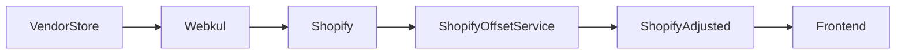

# Shopify Price Offset System

## Overview
This system keeps Shopify prices permanently offset by vendor shipping costs while leaving Webkul at the vendor’s original price. The Shopify price is always the final customer price (base + shipping), which supports “free shipping” messaging without losing margin.

## Data Flow


## Key Components

- **Bulk updater (Shopify-based)**  
  `services/shopify-price-offset/`  
  Updates Shopify prices directly using Admin API. Uses CSV shipping rules and logs to `shopify_price_audit`.

- **Webhook (Shopify product/update)**  
  `app/api/webhooks/shopify-product-update/route.ts`  
  Runs whenever Shopify receives product updates (e.g., Webkul sync). Adds shipping offset immediately so Shopify stays “price + shipping.”

- **CSV shipping rules**  
  `vendor-shipping.csv`  
  Supports base vendor rates, tag overrides, and weight rules (weight not yet used in Shopify flow).

- **Audit logging**  
  `shopify_price_audit` table tracks original Shopify price, offset applied, and adjusted price for rollback and monitoring.

## Why This Architecture
Webkul can re-sync vendor prices into Shopify. If prices are changed in Webkul, those changes get overwritten. By applying the offset **in Shopify only**, prices remain correct even when Webkul updates.

## Prerequisites
- Shopify Admin API access token with:
  - `read_products`
  - `write_products`
  - `read_inventory`
  - `write_inventory`
- Database access (same Postgres instance used for Webkul audit)
- CSV files:
  - `vendor-shipping.csv`
  - `public/seller-to-vendor-mapping.csv` (if vendor mapping is needed)

## Configuration

### Bulk Service Environment
File: `services/shopify-price-offset/.env`
```
SHOPIFY_STORE_DOMAIN=theequestrian.myshopify.com
SHOPIFY_ACCESS_TOKEN=shpat_xxxxxxxxxxxxxxxxxxxxx
DATABASE_URL=postgresql://...
VENDOR_RATES_CSV=../../vendor-shipping.csv
SELLER_MAPPING_CSV=../../public/seller-to-vendor-mapping.csv
SHOPIFY_RATE_LIMIT_PER_SEC=4
SHOPIFY_DRY_RUN=false
```

### Webhook Environment (Vercel)
For `app/api/webhooks/shopify-product-update/route.ts`:
```
SHOPIFY_WEBHOOK_SECRET=...
SHOPIFY_ADMIN_ACCESS_TOKEN=...
SHOPIFY_STORE_DOMAIN=theequestrian.myshopify.com
```

Note: the webhook currently uses **hardcoded vendor/tag rates** inside the route. Keep those in sync with `vendor-shipping.csv` or refactor to load CSV.

## Runbook

### 1) Rollback Webkul Changes (if previous system ran)
Use the existing Webkul rollback to revert vendor prices in Webkul:
```
cd services/webkul-price-offset
npm run rollback
```

### 2) Initialize Shopify Audit Table
```
cd services/shopify-price-offset
npm run db:init
```

### 3) Dry Run (No Changes)
```
npm run bulk:dry-run
```

### 4) Sample Live Run (10 Products)
```
npm run verify:sample
```

### 5) Full Bulk Update
```
npm run bulk
```

Expected duration: ~1.5–2 hours at 4 req/sec, faster on subsequent runs.

## Webhook Automation
Register a Shopify webhook for **products/update**:

- **URL**: `https://theequestrian.vercel.app/api/webhooks/shopify-product-update`
- **Secret**: `SHOPIFY_WEBHOOK_SECRET`
- **Topic**: `products/update`

This ensures that every time Webkul syncs new pricing into Shopify, the offset is re-applied immediately.

## Optional Cron Safety Net
Even with webhooks, schedule a daily bulk run as a safety net:
```
cd services/shopify-price-offset
npm run bulk
```

## Rollback (Shopify)
Revert Shopify prices back to their original values:
```
cd services/shopify-price-offset
npm run rollback
```

## Monitoring & Audit

- Table: `shopify_price_audit`
  - `shopify_price`: original Shopify price (pre-offset)
  - `adjusted_price`: price after offset
  - `shipping_offset`
  - `tag_match`
  - `updated_at`

Recommended checks:
- Query recent updates to confirm offsets.
- Investigate any failed product IDs logged by bulk runs.

## Troubleshooting

**Shopify API 401 Unauthorized**
- Token missing or invalid
- App not installed
- Missing scopes

**Shopify API 429 Too Many Requests**
- Reduce `SHOPIFY_RATE_LIMIT_PER_SEC` to 2
- Re-run; the queue handles throttling

**No shipping offset found**
- Vendor name mismatch (check `vendor-shipping.csv`)
- Tag override missing
- Ensure vendor casing matches (case-insensitive is supported)

**Webhook not applying offset**
- Confirm webhook secret
- Confirm Shopify app token in Vercel
- Check webhook logs in Vercel
- Ensure `products/update` topic is registered

## Operational Notes

- Shopify should be the **only place** where offsets are applied.
- Webkul should sync **to** Shopify, but not the other way around for price fields.
- If Webkul “Dual Sync” is enabled, ensure **Price** and **Compare At Price** are disabled for Shopify → Webkul sync.

