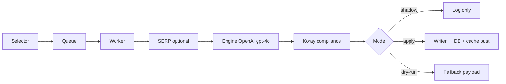

# Product Enrichment Framework

> **Collective vendor migrations:** see [COLLECTIVE-METADATA-ENRICHMENT-FRAMEWORK.md](./COLLECTIVE-METADATA-ENRICHMENT-FRAMEWORK.md) for the canonical runbook (metadata-only, normalisation, augment layer, fact-fidelity gate).

How titles, descriptions, bullet points, and heading tags are enriched — including legacy full enrichment and Collective `--metadata-only` mode.

## Pipeline overview



### Entry points

| Command | Purpose |
|---------|---------|
| `npm run brand:migration:seo-shadow` | `SEO_ENRICHMENT_MODE=shadow`, metadata-only, scoped to vendor/brand |
| `npm run brand:migration:seo-apply` | Same, but writes to DB when compliance passes |
| `tsx scripts/run-seo-enrichment.ts --metadata-only --vendor=... --brand=...` | Direct CLI |

### Modes

Set via `SEO_ENRICHMENT_MODE`:

| Mode | Behaviour |
|------|-----------|
| `dry-run` | No OpenAI call (or fallback from existing values); no DB writes |
| `shadow` | Full generation + audit log; **no** DB writes |
| `apply` | Writes to DB when Koray compliance gate passes |

### Key files

| Path | Role |
|------|------|
| `lib/seo-enrichment/engine.ts` | OpenAI prompts, full vs metadata-only branching |
| `lib/seo-enrichment/writer.ts` | Apply/shadow, compliance gate, cache bust |
| `lib/seo-enrichment/validation.ts` | Zod schemas + `sanitizeHtml()` |
| `lib/seo-enrichment/koray.ts` | Koray system prompt builder |
| `lib/seo-enrichment/koray-compliance.ts` | Scoring before apply |
| `lib/seo-enrichment/queries.ts` | `upsertProductOverride` / `upsertProductMetadataOverride` |
| `scripts/run-seo-enrichment.ts` | CLI (`--metadata-only`, `--vendor`, `--brand`) |
| `app/[category]/[subcategory]/[product]/page.tsx` | PDP resolution of overrides vs Shopify |
| `components/product/ProductDescription.tsx` | Renders description HTML |

---

## Two product enrichment modes

### 1. Full product enrichment (default)

Used for legacy headless PDP content. **Replaces** vendor copy.

| Field | Output | DB flag on apply |
|-------|--------|------------------|
| `meta_title` | ≤68 chars | `use_headless_meta_title = TRUE` |
| `meta_description` | ≤158 chars | `use_headless_meta_description = TRUE` |
| `title_override` | H1 text (plain string, not HTML) | `use_headless_title = TRUE` |
| `description_html` | Full AI HTML body | `use_headless_description = TRUE` |
| `top_description_html` / `bottom_description_html` | Optional split sections | same flags |
| `bullet_points` | Up to 10 E-A-V strings (e.g. `"Material: Premium leather"`) | `use_headless_bullets = TRUE` |
| `internal_link_suggestions` | 3–5 paths | Stored separately; embedded in HTML by model |

**HTML rules in the prompt** (`engine.ts`):

- `<h2>` / `<h3>` only — **never `<h1>`** (page already has `<h1>` from `title_override`)
- “Extractive answers”: short `<p>` blocks immediately after each heading
- Internal links embedded as `<a href="/path">…</a>` in the HTML
- Start directly with content; no redundant product-name heading at the top

**Compliance threshold:** 72 (may regenerate once if below)

**Writes via:** `upsertProductOverride` — all `use_headless_*` flags set to `TRUE`, including description.

---

### 2. Collective metadata mode (`--metadata-only`)

Used for Collective migrations (e.g. Roeckl/Trailrace). Implements [COLLECTIVE-METADATA-ENRICHMENT-FRAMEWORK.md](./COLLECTIVE-METADATA-ENRICHMENT-FRAMEWORK.md).

**CLI flags:**

| Flag | Effect |
|------|--------|
| `--metadata-only` | Title, meta, E-A-V bullets (vendor body untouched) |
| `--normalise-description` | Deterministic layout fix → writes `description_html` only when changed |
| `--collective-augment` | Grounded `top_`/`bottom_description_html` + fact-fidelity gate |
| `--no-normalise-description` | Disable normalisation even if env is set |

| Field | Generated? | DB flag on apply |
|-------|------------|------------------|
| `meta_title` | Yes | `use_headless_meta_title = TRUE` |
| `meta_description` | Yes | `use_headless_meta_description = TRUE` |
| `title_override` | Yes (acts as H1) | `use_headless_title = TRUE` |
| `bullet_points` | Yes — 5–8 E-A-V strings | `use_headless_bullets = TRUE` |
| `description_html` | **No** — explicitly forbidden in prompt | `use_headless_description = FALSE` |

The model receives `vendor_description` (truncated to 4000 chars) as **factual context only** — it must not rewrite or output HTML body content.

**Compliance threshold:** 60 (lighter gate)

**Checks:** macro context vs vendor description, E-A-V bullets, fluff phrases — **no heading/HTML checks**

**Writes via:** `upsertProductMetadataOverride` — title/meta/bullets on; description flags explicitly `FALSE`.

Enable via CLI flag or env:

```bash
SEO_ENRICHMENT_METADATA_ONLY=true
# or
tsx scripts/run-seo-enrichment.ts --metadata-only --vendor="Trailrace Equestrian Outfitters" --brand=Roeckl
```

---

## Koray framework layer

Every run goes through:

1. **`koray-framework.json`** + **`koray-retrieval.ts`** — selects intent-specific rules from GSC data
2. **`koray.ts`** — injects the 10 Semantic SEO principles into the system prompt
3. **`koray-compliance.ts`** — scores output before apply

### Full mode compliance checks

| Check | What it measures |
|-------|------------------|
| Macro context | Token overlap between title and description |
| Extractive answers | `<p>` word count after `<h2>`/`<h3>` headings |
| E-A-V coverage | Bullets with `:` and numeric facts |
| Internal links | Valid internal paths suggested |
| Fluff | Penalty for phrases like “premium quality”, “world class” |

Pass rule: score ≥ 72 and ≤ 2 failed checks.

### Metadata-only compliance checks

| Check | What it measures |
|-------|------------------|
| Macro context | Title vs vendor description (or meta desc fallback) |
| E-A-V coverage | Bullet format |
| Fluff | Marketing filler in title/meta/bullets |

Pass rule: score ≥ 60 and ≤ 1 failed check.

---

## How the PDP renders enriched content

Resolution uses `composeProductDescriptionHtml()` (`lib/products/compose-product-description.ts`) and `resolveProductPageTitle()` / `resolveProductPageDescription()` (`lib/seo/product-metadata.ts`).

```typescript
const displayTitle = override?.use_headless_title
  ? (override?.title_override || product.title)
  : product.title;

const { html: descriptionHtml } = composeProductDescriptionHtml({
  shopifyDescriptionHtml: product.descriptionHtml,
  override,
});

// <title> — enriched meta_title when use_headless_meta_title, else legacy FREE Shipping template
const title = resolveProductPageTitle(seoMetadata, override);

const featureHighlights = override?.use_headless_bullets && overrideBullets.length > 0
  ? overrideBullets
  : getProductBulletPoints(product.id);
```

### When metadata-only is applied

| Element | Source |
|---------|--------|
| **`<h1>`** | `title_override` (if `use_headless_title`) |
| **`<title>` / meta description** | Override `meta_title` / `meta_description` when `use_headless_meta_*` — **not** the FREE Shipping `proposedTitle` template |
| **Feature bullets** | Override `bullet_points` (if `use_headless_bullets`) |
| **Description box** | Shopify `descriptionHtml` by default; `description_html` override only when normalisation changed layout (`use_headless_description = TRUE`) |

### Description component behaviour

`ProductDescription.tsx` adds its **own `<h2>`** wrapper — it does not use headings from vendor/override HTML inside the body:

```tsx
<h2 className="text-2xl font-bold ...">
  {productTitle} Description
</h2>
<div dangerouslySetInnerHTML={{ __html: html }} />
```

Prose classes (`prose-p`, `prose-ul`, etc.) provide spacing **only when the HTML contains block elements**. A single `<p>` wall (typical Collective import) renders as one dense block — no post-processing today.

---

## Validation today

`sanitizeHtml()` in `validation.ts`:

- Strips `<script>` tags
- Strips `on*` event attributes
- Trims whitespace

**Description normalisation** (`lib/seo-enrichment/description-normalisation.ts`):

- Sources **Shopify `descriptionHtml`** during enrichment (not plain-text DB description)
- Preserves inline HTML (`<a href="…">Size Chart</a>`, etc.) when splitting block-of-text
- Writes `description_html` override **only when layout actually changed**

**Meta title on PDP** (`lib/seo/product-metadata.ts`):

- `resolveProductPageTitle()` — enriched `meta_title` wins when `use_headless_meta_title`
- Legacy `proposedTitle` FREE Shipping suffix applies only when **not** enriched

---

## Mapping to planned improvements

| Goal | Current state | Gap |
|------|---------------|-----|
| **1. Update title** | Metadata-only generates `title_override`; applied with `use_headless_title = TRUE` | Ready for Roeckl rollout |
| **2. Enriched bullet points** | 5–8 E-A-V bullets from vendor description context | Ready for Roeckl rollout |
| **3. Fix block-of-text descriptions** | Not implemented | Vendor HTML passes through unchanged; metadata-only never touches description |

---

## Recommended approach for description formatting (#3)

A **deterministic formatting pass** (not AI) fits Collective best:

1. After fetch, detect “block of text”: e.g. one `<p>` with >N words, or plain text with no block-level tags
2. Split on sentence boundaries / double newlines → multiple `<p>` tags
3. Optionally split feature lists into `<ul><li>` if pattern-detected
4. Write to `description_html` with **`use_headless_description = TRUE`** only when formatting changed — preserving vendor semantics, not rewriting copy

This keeps metadata-only for title/bullets/meta and adds a separate normalisation step that only fires when needed.

---

## Database schema reference

Overrides live in `product_content_overrides`:

| Column | Purpose |
|--------|---------|
| `title_override` | H1 text |
| `meta_title` / `meta_description` | `<title>` and meta desc |
| `description_html` | Full body HTML (full mode or future formatting pass) |
| `top_description_html` / `bottom_description_html` | Split sections (full mode) |
| `bullet_points` | JSON array of plain strings |
| `use_headless_*` | Per-field toggles for which override wins on PDP |

After apply, writer calls:

- `invalidateProductOverrideCache()`
- `POST /api/internal/revalidate-shopify` with `x-revalidate-secret`

Requires `INTERNAL_REVALIDATE_SECRET` in local env to match Vercel for cache bust to succeed.

---

## Related docs

- [SEO Enrichment Pipeline README](./README.md)
- [SEO Enrichment Rollout Runbook](../SEO-ENRICHMENT-ROLLOUT-RUNBOOK.md)
- [Vendor Onboarding Runbook](../VENDOR-ONBOARDING-RUNBOOK.md)
