# URL Video Creation End-to-End Handoff

This document describes a complete URL-driven video creation system for a Next.js site. It is written as an implementation handoff for another codebase.

The system takes a source URL, reads the page, extracts content and brand context, generates a short branded video, renders social-ready variants, creates thumbnails, stores the output, and presents it for review/download/upload.

Social account connection and social publishing are intentionally out of scope. The final output should be ready to upload manually or through an existing social publishing system.

## Goal

Build a reusable pipeline that can:

1. Accept a URL as the source input.
2. Fetch and parse the URL into structured content.
3. Infer or load the target site's branding guidelines.
4. Generate video copy, scene structure, voiceover script, and calls to action.
5. Render platform-ready video variants.
6. Create thumbnails and cover images suitable for social platforms.
7. Store all video assets and metadata.
8. Provide an admin review flow before the assets are used.

## Recommended Architecture

```mermaid
flowchart LR
  urlRequest["Create Request: URL"] --> sourceFetch[Fetch URL]
  sourceFetch --> contentExtract[Extract Content]
  contentExtract --> brandExtract[Extract Brand Guidelines]
  brandExtract --> contextBuild[Build UrlVideoContext]
  contextBuild --> copyGenerate[Generate Script And Slides]
  copyGenerate --> validateContent[Validate Facts And Claims]
  validateContent --> mediaResolve[Resolve Images And Assets]
  mediaResolve --> audioGenerate[Optional Voiceover And Music]
  audioGenerate --> renderVariants[Render Video Variants]
  renderVariants --> thumbnailStage[Create Thumbnails]
  thumbnailStage --> persistAssets[Persist Assets]
  persistAssets --> reviewGate[Admin Review]
  reviewGate --> socialReady[Social Ready Outputs]
```



Use explicit stages rather than one large "generate video" function. Each stage should save structured output that can be inspected, retried, or regenerated.

## Scope

Included:

- URL fetch and page extraction.
- Structured context creation.
- Brand guideline extraction.
- LLM-based script and slide copy generation.
- Validation and fallback copy.
- Video rendering.
- Voiceover and music as optional stages.
- Landscape and vertical variants.
- Thumbnail and cover image generation.
- Storage and review workflow.
- Social-ready video and thumbnail output.

Excluded:

- OAuth setup.
- Channel credentials.
- Automatic publishing to Facebook, Instagram, YouTube, TikTok, X, or any other platform.
- Comment/engagement management.

## Core Design Principles

- Treat the URL as source material, not as trusted final copy.
- Save structured context before calling an LLM.
- Validate generated claims against extracted source facts.
- Keep brand guidelines deterministic and inspectable.
- Render both `landscape_16_9` and `vertical_9_16`.
- Generate both custom thumbnails and frame thumbnails.
- Require human approval before assets are used externally.
- Store enough metadata to reproduce, debug, and regenerate the video.

## Data Model

Names can be adapted to the target project, but the logical records should remain.

### `url_video_jobs`

One row per queued operation.

```ts
type UrlVideoJob = {
  id: string;
  urlVideoId: string;
  jobKind: 'create' | 'regenerate' | 'regenerate_music' | 'regenerate_thumbnail';
  status: 'queued' | 'rendering' | 'render_failed';
  payload: Record<string, unknown>;
  workerId: string | null;
  startedAt: string | null;
  createdAt: string;
  updatedAt: string;
  errorMessage: string | null;
};
```

### `url_videos`

One durable record per URL video.

```ts
type UrlVideoRecord = {
  id: string;
  sourceUrl: string;
  sourceCanonicalUrl: string | null;
  status:
    | 'queued'
    | 'rendering'
    | 'render_failed'
    | 'ready_for_review'
    | 'approved'
    | 'rejected';
  contextJson: UrlVideoContext | null;
  promptJson: UrlVideoPromptSnapshot | null;
  renderConfigJson: UrlVideoRenderConfig | null;
  primaryVideoUrl: string | null;
  primaryThumbnailUrl: string | null;
  approvedAt: string | null;
  approvedBy: string | null;
  errorMessage: string | null;
  createdAt: string;
  updatedAt: string;
};
```

### `url_video_assets`

Optional separate table if the app wants queryable asset records.

```ts
type UrlVideoAsset = {
  id: string;
  urlVideoId: string;
  assetType:
    | 'source_html'
    | 'source_image'
    | 'voiceover'
    | 'music'
    | 'video'
    | 'thumbnail'
    | 'cover';
  variant: 'landscape_16_9' | 'vertical_9_16' | null;
  url: string;
  contentType: string | null;
  width: number | null;
  height: number | null;
  durationSeconds: number | null;
  metadata: Record<string, unknown>;
  createdAt: string;
};
```

## State Model

Use explicit states. Avoid inferring state from missing URLs or log messages.

| State | Meaning | Next states |
| --- | --- | --- |
| `queued` | A video creation request has been accepted. | `rendering`, `render_failed` |
| `rendering` | A worker or inline process is generating assets. | `ready_for_review`, `render_failed` |
| `render_failed` | Creation failed. Store a useful `errorMessage`. | `queued` via retry |
| `ready_for_review` | Video variants and thumbnails exist. | `approved`, `rejected`, `queued` via regenerate |
| `approved` | A human approved the video assets. | terminal for this system |
| `rejected` | A human rejected the output. | `queued` via regenerate |

## URL Input Contract

The create API should accept a source URL and optional generation controls.

```ts
type CreateUrlVideoRequest = {
  sourceUrl: string;
  targetSiteUrl?: string;
  brandProfileId?: string;
  goal?: 'educate' | 'explain' | 'announce' | 'promote' | 'summarise' | 'inspire';
  audience?: string;
  tone?: 'clear' | 'expert' | 'friendly' | 'premium' | 'practical' | 'warm';
  maxDurationSeconds?: number;
  includeVoiceover?: boolean;
  includeMusic?: boolean;
  ctaUrl?: string;
  ctaLabel?: string;
};
```

Validation rules:

- Only allow `http:` and `https:` URLs.
- Block localhost, private IP ranges, metadata service IPs, and file URLs.
- Set request timeouts.
- Limit response size.
- Require `response.ok` before reading HTML or JSON.
- Follow redirects only to allowed protocols.
- Save final canonical URL.

## URL Fetching

Use a dedicated fetch service, not ad hoc fetch calls inside the renderer.

Recommended behavior:

```ts
async function fetchSourceUrl(sourceUrl: string): Promise<FetchedUrlDocument> {
  const response = await fetch(sourceUrl, {
    redirect: 'follow',
    headers: {
      'User-Agent': 'UrlVideoBot/1.0',
      Accept: 'text/html,application/xhtml+xml',
    },
    signal: AbortSignal.timeout(15_000),
  });

  if (!response.ok) {
    throw new Error(`URL fetch failed: ${response.status}`);
  }

  const contentType = response.headers.get('content-type') || '';
  if (!contentType.includes('text/html')) {
    throw new Error(`Unsupported URL content type: ${contentType}`);
  }

  const html = await response.text();
  return {
    requestedUrl: sourceUrl,
    finalUrl: response.url,
    html,
    contentType,
  };
}
```

## Content Extraction

Extract page facts into a structured object. Do not ask the LLM to parse raw HTML directly.

Recommended extraction sources:

- `<title>`
- `<meta name="description">`
- Open Graph tags:
  - `og:title`
  - `og:description`
  - `og:image`
  - `og:url`
  - `og:site_name`
- Twitter card tags.
- Canonical URL.
- Main article/product/body content.
- Headings.
- Important images.
- JSON-LD structured data.

Use a DOM parser such as `cheerio`, `linkedom`, or the target app's existing HTML parser. Do not use regex as the primary HTML parser.

```ts
type ExtractedUrlContent = {
  requestedUrl: string;
  finalUrl: string;
  canonicalUrl: string | null;
  title: string;
  description: string;
  siteName: string | null;
  headings: string[];
  bodyText: string;
  keyImages: Array<{
    url: string;
    alt: string | null;
    width: number | null;
    height: number | null;
    source: 'og' | 'article' | 'json_ld' | 'img';
  }>;
  structuredData: Array<Record<string, unknown>>;
  extractedAt: string;
};
```

Extraction rules:

- Remove nav, footer, cookie banners, scripts, styles, and hidden text.
- Prefer canonical and Open Graph values over noisy DOM text.
- Keep body text capped to a reasonable length, for example 8,000 to 15,000 characters.
- Resolve relative image URLs against the final URL.
- Download and inspect candidate images before using them.
- Reject images that are too small, tracking pixels, icons, sprites, or SVG-only unless the SVG is a logo.

## Brand Guidelines Extraction

Brand guidelines should come from the target site, not from the source URL alone, unless they are the same site.

Inputs:

- `targetSiteUrl`
- existing brand config in the target app
- CSS custom properties
- logo assets
- Open Graph metadata
- current site theme config
- admin overrides

Recommended brand contract:

```ts
type VideoBrandGuidelines = {
  name: string;
  siteUrl: string;
  logoUrl: string | null;
  logoAlt: string | null;
  colors: {
    background: string;
    foreground: string;
    primary: string;
    secondary: string;
    accent: string;
    muted: string;
  };
  typography: {
    headingFontFamily: string;
    bodyFontFamily: string;
    fallbackFontFamily: string;
  };
  visualStyle: {
    borderRadius: 'none' | 'small' | 'medium' | 'large';
    imageTreatment: 'full_bleed' | 'contained' | 'card' | 'editorial';
    motionStyle: 'calm' | 'smooth' | 'energetic' | 'premium';
    density: 'minimal' | 'balanced' | 'information_rich';
  };
  voice: {
    tone: string[];
    bannedPhrases: string[];
    preferredPhrases: string[];
  };
  cta: {
    defaultLabel: string;
    defaultUrl: string;
  };
};
```

Brand extraction priority:

1. Explicit app config or database brand profile.
2. Admin-selected brand profile.
3. Target site CSS variables and theme config.
4. Open Graph metadata from target site.
5. Sensible defaults.

Save the resolved brand guidelines into the video record. This makes old renders reproducible even if the site design later changes.

## URL Video Context

Combine source content and brand guidelines into one deterministic context before calling any LLM.

```ts
type UrlVideoContext = {
  source: ExtractedUrlContent;
  brand: VideoBrandGuidelines;
  goal: 'educate' | 'explain' | 'announce' | 'promote' | 'summarise' | 'inspire';
  audience: string;
  tone: string;
  cta: {
    label: string;
    url: string;
  };
  constraints: {
    maxDurationSeconds: number;
    maxSlides: number;
    requiredDisclaimers: string[];
    bannedClaims: string[];
    mustMention: string[];
  };
  media: {
    heroImageUrl: string | null;
    supportingImageUrls: string[];
    logoUrl: string | null;
  };
};
```

## Script And Slide Generation

Generate a structured video plan rather than one blob of copy.

Recommended output:

```ts
type UrlVideoPromptSnapshot = {
  title: string;
  hook: string;
  voiceoverScript: string;
  scenes: Array<{
    id: string;
    durationSeconds: number;
    eyebrow: string | null;
    title: string;
    subtitle: string | null;
    body: string | null;
    imageRole: 'hero' | 'supporting' | 'logo' | 'none';
    motion: 'fade' | 'slide' | 'zoom' | 'pan' | 'cut';
  }>;
  cta: {
    label: string;
    url: string;
  };
  disclaimers: string[];
  validationNotes: string[];
};
```

Recommended scene structure for a 20 to 35 second video:

1. Hook: one strong line based on the URL.
2. Context: what this page is about.
3. Key points: 2 to 4 claims or benefits.
4. Detail: one supporting proof point or visual.
5. CTA: where the viewer should go next.

Generation rules:

- All factual claims must come from `UrlVideoContext.source`.
- Do not invent prices, dates, guarantees, reviews, availability, ratings, or medical/legal/financial claims.
- Keep slide text short.
- Keep voiceover natural and readable.
- Use the brand voice and banned phrases from `VideoBrandGuidelines`.
- If source content is thin, generate a simple summary video rather than adding unsupported claims.

## Validation

Run validation before rendering.

Minimum validation:

- Required fields exist.
- Total duration is within limits.
- Scene count is within limits.
- CTA URL is valid.
- No banned phrases.
- No unsupported claims.
- No empty title or hook.
- Voiceover length roughly matches duration.
- All image URLs are reachable or safely omitted.

Example:

```ts
type ValidationResult =
  | { ok: true; value: UrlVideoPromptSnapshot }
  | { ok: false; reason: string; fallback: UrlVideoPromptSnapshot };
```

If LLM output fails validation, use a fallback generator that builds a conservative summary from the extracted URL title, description, headings, and CTA.

## Media Resolution

Before rendering:

- Download selected remote images.
- Convert them to safe buffers or data URLs.
- Normalize orientation.
- Reject broken or tiny images.
- Prefer Open Graph image as hero if it is large enough.
- Use target site logo from brand guidelines.
- Keep all downloaded media in temporary worker storage only unless it should be persisted.

Recommended image selection:

1. `og:image` if width and height are suitable.
2. First large article/product image.
3. First JSON-LD image.
4. Brand/default fallback image.

For vertical video, choose images that tolerate center cropping. Avoid wide images with important text at the edges.

## Audio

Audio is optional but should be part of the architecture.

Voiceover:

- Generate from `voiceoverScript`.
- Store provider, voice ID, duration, URL, and transcript.
- Keep the voiceover optional if TTS fails.

Music:

- Generate or select instrumental background music.
- Keep volume low under voiceover.
- Store music URL and provider metadata.
- Allow regenerate music without regenerating the full video script.

Audio contract:

```ts
type AudioAssets = {
  voiceover: {
    url: string;
    contentType: string;
    durationSeconds: number;
    transcript: string;
    provider: string;
  } | null;
  music: {
    url: string;
    contentType: string;
    durationSeconds: number;
    provider: string;
    metadata: Record<string, unknown>;
  } | null;
};
```

## Render Variants

Render at least two variants:

```ts
type VideoVariantSpec = {
  key: 'landscape_16_9' | 'vertical_9_16';
  width: number;
  height: number;
  aspectRatio: '16:9' | '9:16';
  platformTargets: string[];
};

const variants: VideoVariantSpec[] = [
  {
    key: 'landscape_16_9',
    width: 1920,
    height: 1080,
    aspectRatio: '16:9',
    platformTargets: ['youtube', 'website', 'linkedin'],
  },
  {
    key: 'vertical_9_16',
    width: 1080,
    height: 1920,
    aspectRatio: '9:16',
    platformTargets: ['instagram_reels', 'facebook_reels', 'tiktok', 'youtube_shorts'],
  },
];
```

Recommended render implementation:

- Use React-based video composition where possible.
- Render via worker process, not the admin request thread.
- Use FFmpeg for final encoding and frame thumbnail extraction.
- Upload outputs to object storage.
- Save all output URLs and metadata.

Recommended video encoding:

- MP4 container.
- H.264 video.
- AAC audio.
- 30 fps.
- `yuv420p` pixel format.
- Fast start enabled for web playback.
- Keep videos under platform-specific duration and file size limits.

## Render Input Contract

```ts
type UrlVideoRenderInput = {
  urlVideoId: string;
  sourceUrl: string;
  brand: VideoBrandGuidelines;
  prompt: UrlVideoPromptSnapshot;
  media: {
    logoBuffer: Buffer | null;
    heroImageBuffer: Buffer | null;
    supportingImageBuffers: Buffer[];
  };
  audio: AudioAssets;
  variants: VideoVariantSpec[];
  totalDurationSeconds: number;
};
```

## Renderer Behavior

Each variant should:

- Use the same script and scene structure.
- Reflow layout for aspect ratio.
- Preserve brand colors and typography.
- Keep text within safe areas.
- Avoid placing important content behind social UI overlays.
- Use motion sparingly and consistently with brand style.

Vertical safe area guidance:

- Avoid critical text in the top 12 percent.
- Avoid critical text in the bottom 18 percent.
- Avoid narrow text blocks that become unreadable on mobile.
- Prefer larger type and fewer words per scene.

Landscape safe area guidance:

- Keep key text within the center 80 percent.
- Avoid placing logos too close to edges.
- Make CTA readable at small thumbnail sizes.

## Thumbnail Creation

Generate two thumbnail types per variant.

### 1. Frame thumbnail

Extract a frame from the rendered video using FFmpeg.

Recommended:

- Extract after the intro/blank frame.
- Use a timestamp around 25 to 50 percent of the video duration.
- Avoid blank frames or transition frames.
- Save as JPEG.

Example:

```bash
ffmpeg -y -ss 14.0 -i input.mp4 -frames:v 1 -q:v 2 thumbnail.jpg
```

### 2. Custom thumbnail

Render a composed thumbnail from brand and content.

Use:

- Brand background color.
- Brand accent.
- Page title or hook.
- Logo.
- Hero image.
- Short CTA or category label.

Custom thumbnail contract:

```ts
type CustomThumbnailInput = {
  variant: 'landscape_16_9' | 'vertical_9_16';
  title: string;
  eyebrow: string | null;
  brand: VideoBrandGuidelines;
  logoDataUrl: string | null;
  heroImageDataUrl: string | null;
};
```

Thumbnail output:

```ts
type ThumbnailOutput = {
  variant: 'landscape_16_9' | 'vertical_9_16';
  frameThumbnailUrl: string | null;
  customThumbnailUrl: string | null;
  recommendedCoverUrl: string | null;
};
```

Recommended cover selection:

- YouTube: use custom thumbnail.
- Website preview: use custom thumbnail.
- Instagram Reels: use frame thumbnail if the custom thumbnail is too text-heavy.
- Facebook Reels: use frame thumbnail or uploaded image thumbnail if the API supports it.
- TikTok/manual upload: use frame thumbnail or manually selected cover.

Avoid social covers that are mostly blank, overly text-heavy, or cropped at the edges.

## Persistence

After render succeeds, save:

```ts
type UrlVideoRenderConfig = {
  renderer: 'react' | 'hyperframes' | 'remotion' | string;
  fps: number;
  durationSeconds: number;
  brand: VideoBrandGuidelines;
  variants: Array<{
    key: 'landscape_16_9' | 'vertical_9_16';
    width: number;
    height: number;
    aspectRatio: '16:9' | '9:16';
    platformTargets: string[];
    videoUrl: string;
    frameThumbnailUrl: string | null;
    customThumbnailUrl: string | null;
    recommendedCoverUrl: string | null;
  }>;
  audio: AudioAssets;
  source: {
    requestedUrl: string;
    finalUrl: string;
    canonicalUrl: string | null;
  };
};
```

Set video record:

- `status = 'ready_for_review'`
- `primaryVideoUrl = landscape video URL or vertical video URL based on product choice`
- `primaryThumbnailUrl = preferred custom thumbnail URL`
- `promptJson = generated prompt snapshot`
- `renderConfigJson = render config`
- `errorMessage = null`

## Review UI

The admin UI should show:

- Source URL.
- Extracted page title and description.
- Brand preview.
- Landscape video preview.
- Vertical video preview.
- Frame thumbnail and custom thumbnail previews.
- Generated script/scene copy.
- Download links for all assets.
- Approve button.
- Reject button.
- Regenerate video button.
- Regenerate thumbnail button.
- Regenerate music/voiceover button if audio is enabled.

Approval behavior:

```ts
type ReviewAction =
  | { action: 'approve'; approvedBy: string }
  | { action: 'reject'; reason: string }
  | { action: 'regenerate'; instructions?: string }
  | { action: 'regenerate_thumbnail' }
  | { action: 'regenerate_music' };
```

Only approved assets should be exposed to downstream upload/publishing tools.

## Social-Ready Output

Even without publishing, generate an export payload that another system can consume.

```ts
type SocialReadyVideoPackage = {
  urlVideoId: string;
  sourceUrl: string;
  title: string;
  summary: string;
  approved: boolean;
  variants: {
    landscape_16_9: {
      videoUrl: string;
      thumbnailUrl: string | null;
      filename: string;
      mimeType: 'video/mp4';
    };
    vertical_9_16: {
      videoUrl: string;
      thumbnailUrl: string | null;
      filename: string;
      mimeType: 'video/mp4';
    };
  };
  captions: {
    short: string;
    long: string;
    hashtags: string[];
    ctaUrl: string;
  };
  brand: {
    name: string;
    siteUrl: string;
  };
};
```

Suggested export endpoints:

- `GET /api/admin/url-videos/:id/package`
- `GET /api/admin/url-videos/:id/download/landscape`
- `GET /api/admin/url-videos/:id/download/vertical`
- `GET /api/admin/url-videos/:id/download/thumbnail/:variant`

## API Routes

Recommended Next.js routes:

```txt
app/api/admin/url-videos/create/route.ts
app/api/admin/url-videos/[id]/route.ts
app/api/admin/url-videos/[id]/review/route.ts
app/api/admin/url-videos/[id]/regenerate/route.ts
app/api/admin/url-videos/[id]/regenerate-thumbnail/route.ts
app/api/admin/url-videos/[id]/package/route.ts
```

Create route:

- Validate admin access.
- Validate URL.
- Create or update `url_videos` row.
- Create `url_video_jobs` row.
- Return `{ ok: true, urlVideoId }`.

Worker route/process:

- Claim next queued job.
- Mark `rendering`.
- Build URL context.
- Generate script.
- Render variants.
- Generate thumbnails.
- Persist outputs.
- Mark `ready_for_review`.
- On failure, mark `render_failed` with meaningful error.

## Worker Model

Use a worker for rendering. Do not render long videos inside a request handler in production.

Claim pattern:

```sql
WITH next AS (
  SELECT id
  FROM url_video_jobs
  WHERE status = 'queued'
  ORDER BY updated_at ASC
  FOR UPDATE SKIP LOCKED
  LIMIT 1
)
UPDATE url_video_jobs AS job
SET status = 'rendering',
    worker_id = $1,
    started_at = NOW(),
    updated_at = NOW()
FROM next
WHERE job.id = next.id
RETURNING job.id, job.url_video_id, job.job_kind, job.payload;
```

This allows multiple workers without double-processing the same job.

## Environment Variables

Required:

```bash
DATABASE_URL=
OBJECT_STORAGE_BUCKET=
OBJECT_STORAGE_REGION=
OBJECT_STORAGE_ACCESS_KEY_ID=
OBJECT_STORAGE_SECRET_ACCESS_KEY=
OBJECT_STORAGE_PUBLIC_BASE_URL=
ADMIN_AUTH_SECRET=
```

Optional:

```bash
OPENAI_API_KEY=
ANTHROPIC_API_KEY=
TTS_PROVIDER_API_KEY=
MUSIC_PROVIDER_API_KEY=
URL_VIDEO_INLINE_LOCAL=true
URL_VIDEO_MAX_DURATION_SECONDS=35
URL_VIDEO_DEFAULT_TARGET_SITE_URL=https://example.com
```

Renderer runtime requirements:

- Node.js version compatible with the app.
- FFmpeg available in worker environment.
- Chromium/Puppeteer dependencies if rendering custom thumbnails with a browser.
- Fonts installed or bundled.
- Enough memory for video rendering.
- Temporary writable disk space.

## Error Handling

Every stage should throw actionable errors.

Examples:

- `URL fetch failed: 404`
- `Unsupported URL content type: application/pdf`
- `No usable title found in source URL`
- `No usable image found; using brand fallback`
- `LLM output failed validation: unsupported claim`
- `Renderer failed: ffmpeg exited with code 1`
- `Thumbnail generation failed: no frame extracted`

Store errors on the video record and job record.

## Logging

Use structured stage logs:

```txt
[url-video] start id=...
[url-video] fetched source id=... finalUrl=...
[url-video] extracted content id=... title=...
[url-video] brand resolved id=... brand=...
[url-video] script generated id=... scenes=5
[url-video] render start id=... variant=vertical_9_16
[url-video] render uploaded id=... variant=vertical_9_16
[url-video] thumbnails ready id=...
[url-video] ready_for_review id=...
```

Do not log secrets, tokens, full private payloads, or raw HTML.

## Security

URL ingestion has SSRF risk. Implement these protections:

- Reject private IPs and local addresses after DNS resolution.
- Reject redirects to blocked hosts.
- Use timeouts.
- Limit HTML byte size.
- Limit image download byte size.
- Sanitize extracted text before showing in admin UI.
- Do not execute remote scripts.
- Do not preserve arbitrary remote HTML.
- Strip tracking query params when reasonable.
- Store only the fields needed for reproducibility.

## Testing Checklist

Unit tests:

- URL validator rejects unsafe URLs.
- HTML extractor reads title, description, canonical, OG image.
- Brand resolver returns deterministic defaults.
- Script validator catches missing fields and banned claims.
- Thumbnail selector chooses expected cover URL.

Integration tests:

- Create URL video job.
- Worker claims job.
- Context is saved.
- Render config contains both variants.
- Thumbnails are saved.
- Review approval updates state.
- Package endpoint returns social-ready outputs.

Manual tests:

- Simple article URL.
- Product or landing page URL.
- URL with no useful images.
- URL with redirects.
- URL with large HTML.
- Target site with missing logo.
- Vertical render viewed on mobile.
- Thumbnail viewed in Instagram/Facebook grid dimensions.

## Implementation Order

1. Add data tables and states.
2. Add URL validator and fetcher.
3. Add content extractor.
4. Add brand guideline resolver.
5. Add context builder.
6. Add script and scene generator.
7. Add validation and fallback generator.
8. Add renderer for one variant.
9. Add second variant.
10. Add frame and custom thumbnails.
11. Add object storage persistence.
12. Add worker queue.
13. Add admin review UI.
14. Add package/export endpoint.
15. Add regeneration actions.

## Acceptance Criteria

The system is complete when:

- An admin can submit a URL.
- A worker creates a video from that URL.
- The video follows the target site's brand guidelines.
- Both landscape and vertical video files are produced.
- Frame and custom thumbnails are produced.
- Assets are stored in durable object storage.
- Admin can approve or reject the output.
- Approved output can be downloaded or consumed as a social-ready package.
- No social publishing credentials or channel connections are required for video creation.

## Notes For Porting From This Repo

The following existing patterns are worth copying conceptually:

- Staged service entry point for create/regenerate.
- Queue worker with claim-and-process lifecycle.
- Render variants stored in `renderConfigJson`.
- Frame thumbnail plus custom thumbnail generation.
- Review gate before external use.
- Regeneration split by video, music, and thumbnail.

The target implementation should replace ecommerce/campaign assumptions with the URL context contract in this document.
