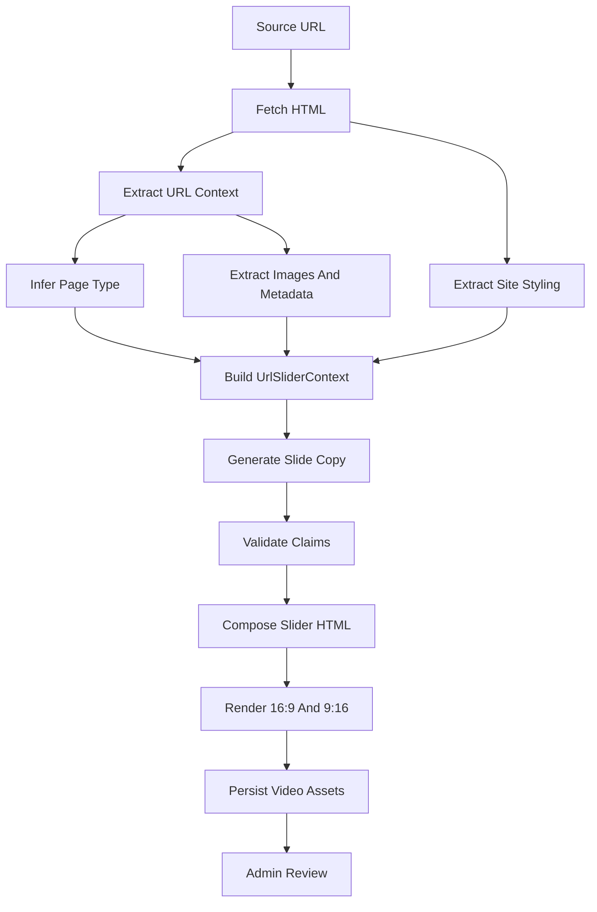

# URL Video Slider Creation Handoff

This document focuses specifically on how the video slider should be created when the source input is a URL. It supplements `docs/url-video-creation-end-to-end-handoff.md` and drills into the slider composition: site styling, slide content, images, layout, animation, render variants, and the data that must be saved for review and publishing.

The goal is to produce a short branded ecommerce slider video from a source URL, using that URL as the source of truth for page context and assets.

## Target Outcome

Given a product, category, brand, promotion, blog, or landing-page URL, the system should:

- Fetch and parse the page into structured context.
- Infer the page type and primary ecommerce intent.
- Extract brand/site styling from the target site.
- Select usable images from the page context.
- Generate fact-safe slide copy.
- Render a four-slide branded video in landscape and vertical formats.
- Persist the source context, slide copy, images, styling, render config, and final media URLs.

The video should feel native to the ecommerce site, not like a generic AI slideshow.

## High-Level Flow



## Source URL Contract

The slider create request should accept:

```ts
type CreateUrlSliderVideoRequest = {
  sourceUrl: string;
  goal?: 'promote' | 'announce' | 'educate' | 'inspire' | 'summarise';
  audience?: string;
  tone?: 'premium' | 'practical' | 'friendly' | 'expert' | 'clear';
  ctaLabel?: string;
  ctaUrl?: string;
  maxDurationSeconds?: number;
};
```

Validation rules:

- Only allow `http:` and `https:`.
- Block private IPs, localhost, file URLs, and metadata service addresses.
- Follow redirects only to safe protocols.
- Require `response.ok` before reading the page.
- Require HTML content for context extraction.
- Save both the requested URL and final canonical URL.

## URL Context Extraction

Extract page context into structured data before any LLM call. Do not ask the LLM to interpret raw HTML directly.

Recommended extraction fields:

```ts
type UrlSliderSourceContext = {
  requestedUrl: string;
  finalUrl: string;
  canonicalUrl: string | null;
  pageType: 'product' | 'category' | 'brand' | 'promotion' | 'article' | 'landing' | 'unknown';
  title: string;
  metaDescription: string;
  h1: string | null;
  headings: string[];
  bodyText: string;
  ogTitle: string | null;
  ogDescription: string | null;
  ogImage: string | null;
  jsonLd: unknown[];
  ecommerceFacts: {
    productTitle?: string;
    brandName?: string;
    categoryName?: string;
    priceText?: string;
    compareAtPriceText?: string;
    availabilityText?: string;
    sku?: string;
    breadcrumbs?: string[];
  };
  imageCandidates: UrlSliderImageCandidate[];
};
```

Use these source priority rules:

- Product facts: prefer structured product data from Shopify or JSON-LD over page prose.
- Category facts: prefer H1, title, breadcrumbs, visible collection text, and product grid labels.
- Brand facts: prefer brand page title/H1, brand copy, brand logo, and visible product range cues.
- General content: use title, meta description, headings, and stripped main body text.

Never fabricate missing prices, stock, delivery promises, materials, warranties, reviews, or product claims.

## Image Extraction

Images drive the slider. Extract them deterministically and validate before rendering.

Recommended image candidate shape:

```ts
type UrlSliderImageCandidate = {
  url: string;
  source: 'og_image' | 'twitter_image' | 'json_ld' | 'product_image' | 'collection_image' | 'brand_logo' | 'html_img';
  altText: string | null;
  width: number | null;
  height: number | null;
  contentType: string | null;
  role: 'hero' | 'product' | 'gallery' | 'logo' | 'supporting' | 'unknown';
  score: number;
};
```

Extraction sources:

- `og:image`
- `twitter:image`
- Product JSON-LD images.
- Shopify product/media image URLs.
- Category/collection hero images.
- Brand logos.
- Main `` tags inside product/content regions.

Filtering rules:

- Ignore `data:` and `blob:` images.
- Ignore SVG placeholders, tracking pixels, icons, payment logos, and sprites.
- Unwrap Next image URLs such as `/_next/image?url=...`.
- Prefer CDN/original image URLs over transformed thumbnails.
- Validate with `HEAD` or bounded `GET` and require `image/*`.
- Store the final public URL used to fetch the image.

Image scoring should prefer:

- Product detail images for product URLs.
- Hero/collection images and product grid images for category URLs.
- Brand logo plus representative product imagery for brand URLs.
- Open Graph image only when richer ecommerce images are unavailable.

## Site Styling Extraction

The slider should reuse the site's visual system where possible.

For this repo, existing video styling is loaded from `app/globals.css` via `lib/email-platform/videos/brand.ts`:

```ts
type VideoBrandStyle = {
  primary: string;
  secondary: string;
  foreground: string;
  background: string;
  fontFamily: string;
};
```

The current implementation reads:

- `--primary`
- `--secondary`
- `--foreground`
- `--background`
- `--font-primary`

For a URL-driven implementation, use this order:

1. If the URL belongs to the current site, load local app styling from `app/globals.css`.
2. If the URL belongs to another target site, extract CSS variables from loaded stylesheets where possible.
3. Fall back to Open Graph `theme-color`, logo colors, or a deterministic default style.
4. Persist the resolved style in the video record so the render can be reproduced.

Recommended style context:

```ts
type UrlSliderBrandStyle = {
  siteName: string;
  siteUrl: string;
  logoUrl: string | null;
  primary: string;
  secondary: string;
  foreground: string;
  background: string;
  surface: string;
  surfaceAlt: string;
  fontFamily: string;
};
```

Logo loading:

- Current repo candidates are `public/logo-full.png`, `public/logo.png`, and `public/email-logo.png`.
- For external URL contexts, prefer site header logo, `og:logo` if present, or favicon only as a last resort.
- Save the logo asset as a fetched buffer or uploaded asset before rendering.

## Slider Context Contract

Before rendering, build one complete context object:

```ts
type UrlSliderContext = {
  source: UrlSliderSourceContext;
  brand: UrlSliderBrandStyle;
  selectedImages: {
    hero: UrlSliderImageCandidate | null;
    logo: UrlSliderImageCandidate | null;
    products: UrlSliderImageCandidate[];
    supporting: UrlSliderImageCandidate[];
  };
  cta: {
    label: string;
    url: string;
  };
  constraints: {
    maxDurationSeconds: number;
    maxSlides: number;
    maxProducts: number;
    bannedClaims: string[];
  };
};
```

This object should be saved before generating copy.

## Slide Copy Contract

Use the same four-slide structure as the existing brand slide videos.

The existing copy shape is:

```ts
type SlideCopy = {
  s1: {
    eyebrow: string;
    title: string;
    subtitle: string;
  };
  s2: {
    eyebrow: string;
    title: string;
    subtitle: string;
    cta: string;
    linkText: string;
  };
  s3: {
    eyebrow: string;
    title: string;
  };
  s4: {
    eyebrow: string;
    title: string;
    cta: string;
  };
};
```

For URL slider videos, the slide meaning should be:

### Slide 0: Logo Stinger

Purpose:

- Quick branded entry.
- Uses site logo only.
- Duration around `0.7s`.

Content:

- Logo asset.
- No URL-derived claims.

### Slide 1: Hook

Purpose:

- Tell viewers what the page is about.
- Establish the product/category/brand/promotion quickly.

Content:

- `eyebrow`: page type label such as `Featured Product`, `Shop The Edit`, `Brand Spotlight`, or `On Sale`.
- `title`: concise source-grounded headline from title/H1/product title/category/brand.
- `subtitle`: short benefit or context line from extracted page description.
- Visual: brand logo card, product hero, category product grid, or sale badge depending on page type.

### Slide 2: Context And CTA

Purpose:

- Explain why the viewer should care.
- Provide the first conversion-oriented CTA.

Content:

- `eyebrow`: context label such as `Why Riders Like It`, `Explore The Range`, or `Built For Everyday Riding`.
- `title`: one short headline from extracted facts.
- `subtitle`: one or two fact-safe sentences.
- `cta`: button label such as `Shop Now`, `Explore The Range`, `View The Product`.
- `linkText`: normalized page URL or short domain/path display.

Visual:

- Product image, brand logo, or supporting lifestyle/category image.

### Slide 3: Product Or Image Grid

Purpose:

- Show concrete products or representative images.

Content:

- `eyebrow`: `Featured Picks`, `From The Range`, or `In This Edit`.
- `title`: short grid heading.

Visual:

- Up to three product/image cards.
- Product cards can show title and price only if those facts were extracted from structured data.
- If price or sale data is missing, omit price entirely.

### Slide 4: Final CTA

Purpose:

- End with a clear action and brand recall.

Content:

- `eyebrow`: `Shop Online`, `Explore More`, or `Discover The Range`.
- `title`: final source-grounded conversion line.
- `cta`: final CTA label.
- Footer/logo: site logo.

Visual:

- Accent gradient background using primary and secondary brand colors.
- Optional thumbnail strip from selected product/supporting images.

## Page-Type Slide Defaults

### Product URL

Use:

- Hero image: primary product image.
- Supporting images: product gallery.
- `s1.title`: product title.
- `s2.subtitle`: product description summary.
- `s3`: supporting product details or product image gallery.
- CTA: `View Product` or `Shop Now`.

Do not claim:

- Price, discount, material, fit, stock, delivery, reviews, or guarantees unless explicitly present.

### Category URL

Use:

- Hero image: category hero or first strong product image.
- Supporting images: product grid images.
- `s1.title`: category/collection title.
- `s2.subtitle`: category description.
- `s3`: grid of representative products/images.
- CTA: `Explore The Range`.

Do not list products unless extracted with names.

### Brand URL

Use:

- Logo image: brand logo if present.
- Supporting images: representative product images from brand page.
- `s1.title`: brand name.
- `s2.subtitle`: brand/range description.
- `s3`: product range or representative images.
- CTA: `Shop The Brand`.

Do not invent brand heritage or performance claims.

### Promotion URL

Use:

- Sale badge and product/category imagery.
- `s1.eyebrow`: `On Sale` or `Limited-Time Offer` only if the page context supports it.
- `s3`: sale product cards if product and price data are available.
- CTA: `Shop The Sale`.

Do not invent sale percentages or urgency.

## Rendering Layout

Reuse the existing brand-slide renderer pattern:

- `brand-slides/composition.ts` builds the HTML document.
- `brand-slides/styles.ts` builds CSS from the brand style and layout.
- `brand-slides/slides.ts` renders stinger and slide 1.
- `brand-slides/slides-detail.ts` renders slides 2 to 4.
- `brand-slides/animations.ts` controls timing and GSAP transitions.

Existing timing:

```ts
const TIMING = {
  stinger: { start: 0, dur: 0.7 },
  s1: { start: 0.5, dur: 4.0 },
  s2: { start: 4.3, dur: 5.4 },
  s3: { start: 9.4, dur: 3.0 },
  s4: { start: 12.2, dur: 3.8 },
  total: 16,
};
```

For URL slider videos, keep the same default `16s` duration unless voiceover generation requires a longer total duration.

## Visual Style Rules

Use these layout conventions from the current renderer:

- Full-bleed canvas sized per variant.
- Brand surface background.
- Accent bar using primary to secondary gradient.
- Eyebrow text in uppercase with letter spacing.
- Strong headline typography.
- Rounded card containers.
- Product images inside soft background cards.
- CTA buttons as rounded pills.
- Final slide uses a radial/gradient brand background.

Existing card behavior:

- Product images use `object-fit: contain` by default.
- Use cover fit only for images that are visually suitable.
- Product cards clamp title text to two lines.
- Price/save badge should render only when structured facts exist.

## Variant Rendering

Render both variants:

```ts
const VIDEO_VARIANT_SPECS = [
  {
    key: 'landscape_16_9',
    width: 1920,
    height: 1080,
    platformTargets: ['youtube', 'x'],
  },
  {
    key: 'vertical_9_16',
    width: 1080,
    height: 1920,
    platformTargets: ['youtube_shorts', 'instagram_reels', 'tiktok', 'facebook_reels', 'x'],
  },
];
```

The same slide context should render responsively in both:

- Landscape: split layouts with text and image/card columns.
- Vertical: stacked layouts with centered text and larger image cards.

Do not generate separate facts for each variant. Only adapt layout.

## Image Asset Preparation

Before rendering:

1. Fetch selected image URLs server-side.
2. Validate `response.ok`.
3. Require `image/*`.
4. Convert to local temp files or data URLs for the renderer.
5. Preserve original source URL and fetched content type in metadata.

For Shopify images:

- Prefer high-resolution CDN URLs.
- If a URL has thumbnail transforms, request a larger width where safe.
- Do not use the Next `/_next/image` proxy URL as the canonical saved asset; unwrap it first.

## Copy Generation Prompt Requirements

The prompt should receive structured context, not raw HTML:

```ts
type UrlSliderCopyPromptInput = {
  pageType: string;
  sourceUrl: string;
  sourceTitle: string;
  sourceDescription: string;
  sourceContent: string;
  ecommerceFacts: Record<string, string | string[] | null>;
  selectedImageAlts: string[];
  brandName: string;
  ctaLabel: string;
  ctaUrl: string;
};
```

Prompt rules:

- Return JSON matching `SlideCopy`.
- Use only supplied facts.
- Do not mention sale/discount unless present in extracted facts.
- Do not include unsupported product claims.
- Keep each slide short enough for video display.
- Australian English.
- Ecommerce promotion framing, but not spammy.

If the LLM output fails validation, use deterministic fallback slide copy.

## Validation Rules

Validate generated slide copy before rendering:

- Required keys exist for `s1`, `s2`, `s3`, and `s4`.
- Text lengths fit the layout.
- No banned phrases or hallucinated sale language.
- Product names only appear if extracted.
- Prices only appear if extracted.
- CTA URL matches canonical source URL or allowed override.
- No raw HTML.
- No unsupported claims about materials, delivery, stock, reviews, or performance.

Store validation source:

- `llm`
- `fallback`
- `override`

Also store rejection reason when falling back.

## Render Config Persistence

Save enough data to reproduce the video:

```ts
type UrlSliderRenderConfig = {
  template: 'url_slider_v1';
  fps: 30;
  duration: number;
  sourceUrl: string;
  canonicalUrl: string | null;
  pageType: string;
  brand: UrlSliderBrandStyle;
  slideCopy: SlideCopy;
  selectedImages: UrlSliderImageCandidate[];
  cta: {
    label: string;
    url: string;
  };
  variants: Array<{
    key: 'landscape_16_9' | 'vertical_9_16';
    width: number;
    height: number;
    aspectRatio: '16:9' | '9:16';
    platformTargets: string[];
    videoUrl: string;
    thumbnailUrl: string | null;
    customThumbnailUrl: string | null;
  }>;
};
```

## Thumbnail Creation

The thumbnail should use the same brand style and selected imagery.

Current thumbnail behavior:

- Landscape: `1280x720`.
- Vertical: `720x1280`.
- Left/top text block with eyebrow, headline, divider, optional logo.
- Right/bottom visual with product or source image.
- Site logo in a corner.
- Accent gradient bar.

For URL sliders:

- Thumbnail title should come from `slideCopy.s1.title`.
- Eyebrow should come from `slideCopy.s1.eyebrow`.
- Product/source image should use the highest-scoring hero/product image.
- Brand logo should use extracted or local site logo.

## Admin Review UI

The admin review surface should show:

- Source URL.
- Page type.
- Extracted title/description.
- Selected images with remove/replace controls.
- Brand colors and logo.
- Slide copy editable by slide.
- Rendered landscape video.
- Rendered vertical video.
- Thumbnail preview.
- Error/retry controls.

The admin should be able to:

- Regenerate copy only.
- Regenerate images/asset selection only.
- Regenerate full video.
- Approve or reject.

## Failure Modes

### URL fetch fails

Store the status and URL. Let admin retry or edit URL.

### No usable images

Render a text/logo-only video using brand style. Warn the admin before approval.

### Bad image dimensions

Use contain-fit cards rather than cropping unless image role is `hero` and aspect is suitable.

### LLM invents unsupported facts

Reject the output and use fallback copy.

### Styling cannot be extracted

Use deterministic default brand style and store `styleSource = fallback`.

### One render variant fails

Keep successful variants, mark missing variant with error metadata, and allow retry.

## Acceptance Criteria

The URL slider video pipeline is ready when:

- URL context is saved before generation.
- Site styling is saved in render config.
- Slide copy is structured and validated.
- Selected image URLs are visible and removable in admin.
- Render outputs include landscape and vertical variants.
- Thumbnails use the same visual system.
- The final video can be approved before social publishing.
- All rendered copy and visible product facts can be traced back to the source URL context.
